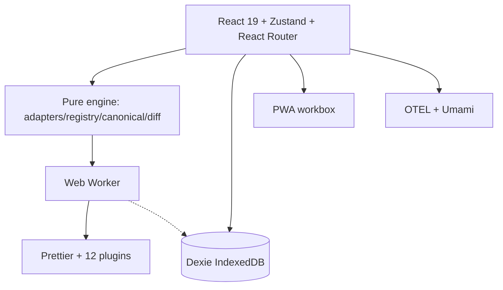
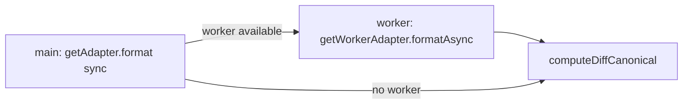
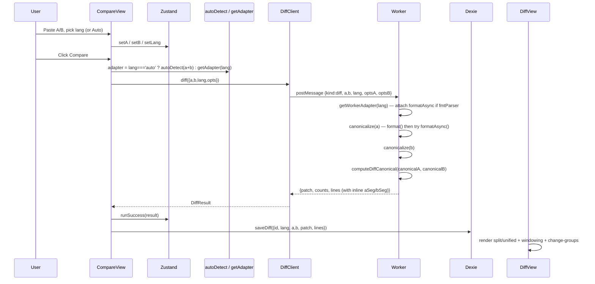
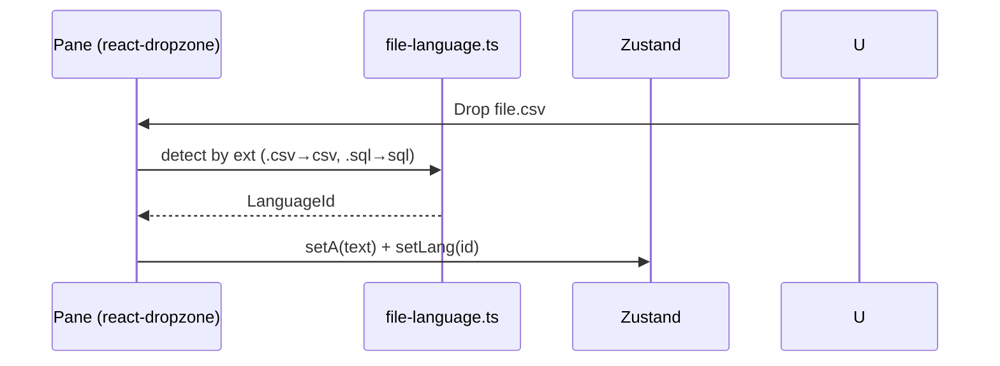
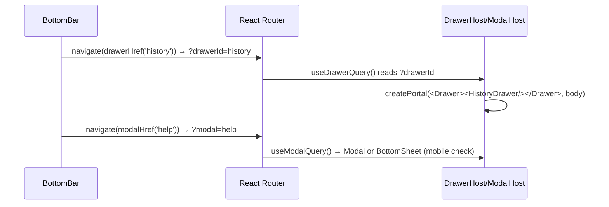

# SyntaxDiff — Engineering Specification

> Source of truth for how SyntaxDiff is built, why, and how it runs. Complements `PRD.md` (what) and `README.md` (how to use).

---

## 1. Purpose

**SyntaxDiff is a privacy-first, client-side syntax-aware diff.** Paste two snippets → auto-detect language → canonicalize (format + normalize) → line diff the structure, not the bytes. Nothing leaves the machine.

Core invariants:

- **Diff structure, not bytes** — key reorder / whitespace / formatting noise = 0 lines. Value change / array order change = surfaced.
- **Privacy by default** — no backend, no CDN at runtime, `connect-src 'none'`-compatible. Optional telemetry (OTEL/Umami) never carries contents.
- **Fast** — parsing + formatting + diff off main thread (Web Worker). 1 MB JSON without jank.

File: `src/main.tsx` → `src/core/app.tsx` → `src/components/app-layout/app-shell.tsx`.

---

## 2. Supported / Not Supported

### Supported (36 adapters in `src/modules/engine/lib/adapters/`)

| Group                         | Languages                                                                                                                                                           | Canonicalization                                              | Formatter                                           | Detect strength                                                                                                              |
| ----------------------------- | ------------------------------------------------------------------------------------------------------------------------------------------------------------------- | ------------------------------------------------------------- | --------------------------------------------------- | ---------------------------------------------------------------------------------------------------------------------------- |
| **Data**                      | `json` `json5` `jsonc` `yaml` `yml` `toml` `xml` `csv` `sql`                                                                                                        | Parse → re-serialize (preserve key order; CSV aligns columns) | Prettier `json/yaml/toml/xml/csv/sql` via worker    | Strict: `JSON.parse` / `js-yaml load` / `smol-toml parse` / `fast-xml-parser` + trailing-comma/comment hints for json5/jsonc |
| **Code (format-enabled)**     | `js` `ts` `go` `php` `html` `css` `less` `scss` `markdown` `mdx` `vue` `angular` `svelte` `astro` `graphql` `gherkin` `handlebars` `pug` `go-template` `nginx` `sh` | Whitespace-normalize + bracket reindent (robust sync)         | Prettier + plugin per parser (worker `formatAsync`) | Scoring, penalizes cross-language markers (TS vs JS, Less vs SCSS)                                                           |
| **Code (formatter-disabled)** | `ruby` `rust` `kotlin` `java` `glimmer`                                                                                                                             | Whitespace-only (`normalizeWhitespace`)                       | None (`formatterDisabled:true`)                     | Same scoring, no worker plugin                                                                                               |
| **Fallback**                  | `plain`                                                                                                                                                             | `ignoreCase` / `ignoreWhitespace`                             | None                                                | Always 0                                                                                                                     |

Registry: `src/modules/engine/lib/registry.ts` — `adapters[]`, `getAdapter(id)`, `autoDetect(input)` (max confidence, fallback `plain`).

### Not Supported (explicit non-goals)

- **Nix / Protobuf** — Nix needs WASM (`nixpkgs-fmt`), Protobuf is binary + schema-dependent. Deferred until WASM isolate exists. See `PRD §2`.
- **Cloud sync / accounts / backend DB** — would violate privacy. History is local Dexie only (`src/core/db.ts`).
- **URL-share of diff content** — leaks data into history; forbidden.
- **Monaco edit-in-place** — read-only diff output for now.
- **WASM in MVP** — pure-JS parsers are smaller/testable; WASM isolated to single async adapter if Nix returns.

---

## 3. Architecture

### 3.1 High-level



### 3.2 Module map

```
src/
  core/
    app.tsx                # Router / shell / drawerRegistry
    store.ts               # Zustand: a/b/labels/lang/opts/mode/status
    stores/use-base-diff.ts
    db.ts                  # Dexie history
    worker/
      client.ts            # Promise wrapper, fallback to sync engine
      worker.ts            # onmessage → canonicalize → computeDiffCanonical
      diff-runner.ts       # canonicalize() + runDiff()
      prettier-adapters.ts # getWorkerAdapter() cache + makePrettierAdapter
      prettier-runtime.ts  # PLUGINS_BY_PARSER map, dynamic imports
      node-builtins-stub.ts
  modules/
    engine/lib/
      types.ts             # LanguageAdapter, DiffResult, ParseError
      registry.ts          # 36 adapters
      canonical.ts         # canonicalize(v, sortKeys)
      diff.ts              # computeDiff / computeDiffCanonical + inline segments
      adapters/*           # per-language format() + detect() + toggles
      test/                # detect/json tests
    compare/               # panes, file import, language select, options
    diff/                  # diff-view, windowing, change-groups, controls
    history/               # history-drawer, filter
    analytics/             # otel, umami, track
  components/
    app-layout/            # app-shell, bottom-bar, drawer-host, modal-host
    inputs/ modal/ bottom-sheet/ split-panes/ drawer/
  hooks/                   # use-app-boot, use-theme, use-github-stars
  vite.config.ts           # Node builtins alias + PWA
  vitest.config.ts
```

### 3.3 Worker isolation

- Main thread imports **only** `src/modules/engine/lib` (pure, sync `format()`).
- Heavy formatter (`prettier` + plugins + `sql-formatter`) lives **only** in `src/core/worker/*`, bundled to `worker-*.js` chunk (~9 MB, precached with `maximumFileSizeToCacheInBytes:12MB`).
- Vite aliases in `vite.config.ts` / `vitest.config.ts` stub `fs/path/process/util/url` → `node-builtins-stub.ts` so plugins don't crash in worker/happy-dom.
- `client.ts` tries `new Worker(...)`; if unavailable (jsdom tests) falls back to inline `computeDiff`.



---

## 4. Dependencies

### Runtime (`package.json:dependencies`)

| Dep                                                                                                             | Purpose                                                  |
| --------------------------------------------------------------------------------------------------------------- | -------------------------------------------------------- |
| `react@19` `react-dom` `react-router-dom@7`                                                                     | UI + routing                                             |
| `zustand@5`                                                                                                     | Lightweight store                                        |
| `dexie@4`                                                                                                       | IndexedDB history                                        |
| `diff@8`                                                                                                        | `diffLines`, `diffWordsWithSpace`, `createTwoFilesPatch` |
| `js-yaml@4` `smol-toml@1` `fast-xml-parser@5` `sql-formatter@15`                                                | Data canonicalization                                    |
| `prettier@3` + 12 plugins (`@prettier/plugin-php`, `prettier-plugin-astro/java/nginx/sh/sql/svelte/toml`, etc.) | Worker async formatting                                  |
| `@opentelemetry/*` `ua-parser-js` `marked`                                                                      | Telemetry / logs                                         |
| `tailwindcss@4` `@tailwindcss/vite` `clsx` `lucide-react` `react-dropzone` `workbox-window`                     | UI                                                       |

### Dev (`devDependencies`)

`typescript@6`, `vite@8`, `vitest@3`, `happy-dom`/`jsdom`, `oxlint`/`oxfmt`, `husky@9`, `@vitejs/plugin-react`, `vite-plugin-pwa`, `@testing-library/*`, `fake-indexeddb`.

No `semantic-release` — releases are manual GitHub Releases (row below).

---

## 5. Solutions / Key Decisions

| Decision                                                          | Why                                                                                    | Alternative skipped                           |
| ----------------------------------------------------------------- | -------------------------------------------------------------------------------------- | --------------------------------------------- |
| **Pure engine (`src/modules/engine`)**                            | Runs in worker and Node tests without DOM; framework-free                              | Coupling engine to React                      |
| **Two-layer canonicalize** (`format` sync + `formatAsync` worker) | Main thread never imports Prettier; fallback robust on formatter failure               | Bundling Prettier to main (huge)              |
| **Zustand over Redux**                                            | Minimal store, no boilerplate; selectors keep rerenders scoped (`useBaseDiff`)         | Redux toolkit                                 |
| **Dexie for history**                                             | IndexedDB with `orderBy(createdAt).reverse()`; works offline                           | `localStorage` (sync, size limit)             |
| **Route-driven overlays** (`?drawerId=`, `?modal=`, `?sheet=`)    | Deep-linkable, back-button safe, distinct scrims (`Drawer z-50` vs `Modal z-[60]`)     | Local `useState` stacking scrims              |
| **devenv (Nix) over mise/devcontainer**                           | Reproducible `nodejs_24` + `pnpm`, `devenv.nix` + `.envrc`                             | mise.toml / .devcontainer                     |
| **Husky pre-commit** (`oxfmt --check` + `oxlint` + `tsc -b`)      | Fail fast before push; 5ms fmt + typecheck                                             | lint-staged per-file (overkill for 190 files) |
| **No WASM**                                                       | Pure-JS parsers smaller/testable for Phase-1 langs                                     | WASM for Nix only                             |
| **Array order preserved**                                         | Sorting arrays fabricates diffs (`canonical.ts` maps arrays via `v.map(canonicalize)`) | Sorting everything                            |

---

## 6. Sequence Diagrams

### 6.1 Compare (happy path)



### 6.2 File import + language from extension



### 6.3 History / overlay routes



---

## 7. Release Plan

### CI (`on: push[main], pull_request, release[published]`)

```
verify → build → deploy
```

- **verify** — `pnpm install --frozen-lockfile` → `oxfmt --check` → `oxlint` → `tsc -b --noEmit` → `vite build` → `vitest run`
- **build** — `needs: verify`, `if: github.event_name != 'pull_request'`
  - `meta` step: `release` event → `TAG=${{ github.event.release.tag_name }}` (e.g. `syntaxdiff_v1.2.3`), `tags=...:${TAG},...:${TAG#syntaxdiff_v},...:latest`; else `latest` + `version=Nightly`
  - `docker/build-push-action@v6` → `ghcr.io/${{ github.repository }}:${tag}` with `VITE_APP_VERSION`
- **deploy** — `needs: build`, `curl -fsS -X POST $DEPLOY_WEBHOOK_URL` if set

No `release.yml` / `.releaserc.json` / `semantic-release` — releases are **manual GitHub Releases** (Draft → Publish in UI). Workflow skips image build on PRs.

### Versioning

- Image tags: `ghcr.io/dimasbaguspm/syntaxdiff:latest` on every `push` to `main`; plus `syntaxdiff_v<ver>` and `<ver>` on `release:published`.
- In-app `v{APP_VERSION}` badge from `VITE_APP_VERSION` (fallback `Nightly`).
- `CHANGELOG.md` stays curated; no auto `semantic-release` bumps (ponytail: delete generation, keep hand-written).

### Dockerfile

`node:24-alpine` build → `nginx:1.27-alpine` serve, SPA fallback `try_files $uri /index.html`, hashed `/assets/` immutable cache, gzip.

---

## 8. Operational Plan

- **Dev env** — `devenv.nix` (`nodejs_24`, `pnpm`), `devenv.yaml` (nixpkgs rolling), `.envrc` (`devenv print-dev-env`). No mise/devcontainer.
- **Pre-commit** — `.husky/pre-commit` runs `oxfmt --check`, `oxlint --vue-plugin`, `tsc -b --noEmit` (fail fast; `vitest` left to CI for speed). `package.json:prepare=husky`.
- **PWA** — `vite-plugin-pwa` `generateSW`, precache 18 entries (~10 MB with worker chunk), `registerType: prompt` + `PwaUpdateBanner`.
- **Observability** — OTEL traces/logs to `VITE_OTEL_COLLECTOR_URL`, Umami `trackEvent` lazy-loaded via `VITE_UMAMI_WEBSITE_ID`. Never logs `a`/`b` contents.
- **Branching** — protected `main` (required `Verify` check). Feature branches → PR → squash merge (`refactor/cleanup` example). No direct push to `main`.
- **Backup** — Dexie history is client-only; `Clear` / `deleteDiff` are local. No server backup needed.
- **Runbook** — `pnpm dev` (5173), `pnpm build` + `pnpm preview`, `pnpm test`, `pnpm fmt` / `fmt:check`, `pnpm lint`, `pnpm typecheck`. Env `VITE_OTEL_COLLECTOR_URL`, `VITE_UMAMI_WEBSITE_ID`, `VITE_APP_VERSION` injected at build time.

---

## 9. Future Deferrals

- WASM adapter isolate for Nix (`nixpkgs-fmt`) if Nix returns.
- Lazy-loaded parser chunks if main bundle regresses.
- `lint-staged` per-file pre-commit if repo grows >500 files (ponytail: kept full-repo check for now).
