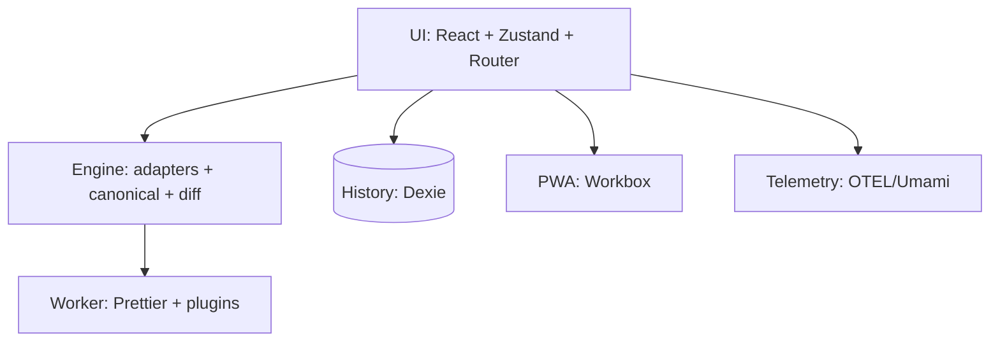
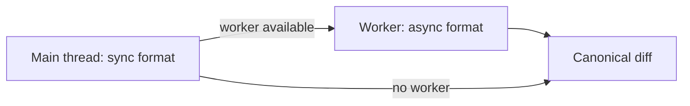
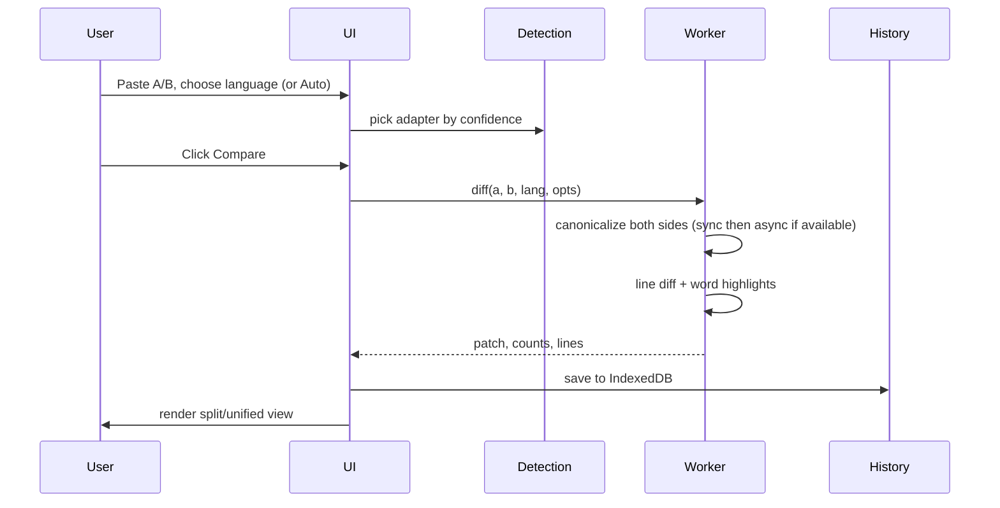
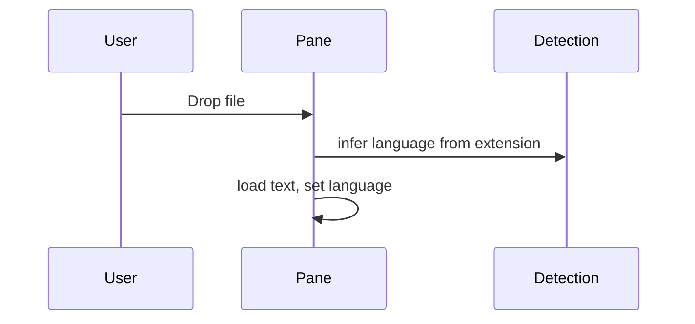
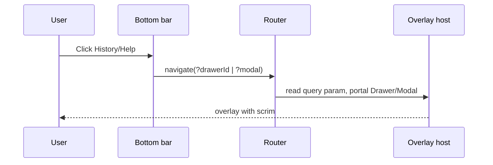

# SyntaxDiff - Engineering Specification

## 1. Purpose

SyntaxDiff is a privacy-first, client-side syntax-aware diff. Two snippets go in, a structured diff comes out. Formatting noise and key reorder are invisible, real value changes and array order are visible. Everything runs in the browser; no content leaves the machine.

The product exists to answer one question quickly: did the structure change? Paste, compare, and trust the result without worrying about whitespace, ordering, or leaking data.

## 2. Problem

Dumb text diffs report false positives. A JSON object with the same keys in a different order, a YAML file with reordered fields, or SQL with different casing shows up as a change when nothing structurally changed. Those false positives waste review time and hide real changes.

At the same time, sharing snippets to a server for diffing creates privacy risk, and heavy parsers on the main thread freeze the UI on large inputs. The engineering problem is to provide a fast, accurate, offline diff that understands language structure and stays fully local.

## 3. Solution

Parse each input, canonicalize it to a stable form, then diff the canonical text. Canonicalization is language-specific. JSON re-serializes, SQL formats and uppercases keywords, CSV normalizes and optionally aligns, but the pipeline is uniform:

```
parse → canonicalize → line diff → render
```

Array order is always preserved; only object keys and formatting are normalized. The canonical step runs in a Web Worker with a lightweight synchronous fallback, so the UI remains responsive even for large payloads. Results are rendered as split or unified views with a draggable divider, saved to local history, and available offline via PWA.

## 4. Approaches

- **Detect then canonicalize**: Heuristics pick the language per adapter (confidence 0-1, fallback to plain text); the adapter then applies its own format. No shared parser; each language owns its rules.
- **Worker-first with sync fallback**: The main thread only holds the pure, synchronous `format()`. The heavy Prettier-based `formatAsync()` lives exclusively in the worker bundle, keeping the main bundle small and the fallback safe for tests.
- **Route-driven overlays**: Drawers, modals and sheets are opened via URL query params (`?drawerId=`, `?modal=`, `?sheet=`), making them deep-linkable and preventing stacked scrims.
- **Local-first persistence**: History lives in IndexedDB (Dexie), not a backend. PWA precaches the app and the worker chunk for offline use.
- **Fail-safe by default**: If a formatter throws, fall back to the robust canonical text. Never block a diff because of formatting.

Supported languages (36 adapters): JSON/JSON5/JSONC, YAML/YML, TOML, XML, CSV, SQL, JS/TS, Go, PHP, HTML/CSS/Less/SCSS, Markdown/MDX, Vue/Angular/Svelte/Astro, GraphQL, Gherkin, Handlebars/Pug/Go-template/Glimmer, Nginx/Sh, plus plain text fallback. Formatter-disabled languages (Ruby, Rust, Kotlin, Java, Glimmer) use whitespace-only canonicalization.

Not supported: Nix/Protobuf (needs WASM/binary schema), cloud sync/accounts, URL-share of content, WASM in MVP, and inline Monaco editing. All are deferred to preserve privacy and scope.

## 5. Architecture



The UI owns state and routing; the engine owns language knowledge; the worker owns heavy formatting.

- **UI** handles input panes, language selection, options, split/unified views, and overlay routes (drawer/modal/sheet hosts with distinct z-layers and portals).
- **Engine** exposes a uniform adapter interface (`detect`, `toggles`, `format`, optional `formatAsync`) and a registry that picks the best adapter. Canonicalization and diff are pure functions.
- **Worker** isolates Prettier and its plugins to a separate chunk, aliased to browser stubs for Node builtins, with a cache for worker adapters and a graceful fallback to the sync path.



## 6. Sequence Diagrams

### Compare



### File import



### Overlays



## 7. Release Plan

### CI

Single workflow on `push[main]`, `pull_request`, and `release[published]`:

```
verify → build → deploy
```

- **Verify** runs on every event: install, format check, lint, typecheck, build, and tests. It is the required status check for protected `main`.
- **Build** runs only outside PRs. It tags the image as `latest` on pushes to `main`, and as both `latest` and the release tag (e.g. `syntaxdiff_v1.2.3` and `1.2.3`) when a GitHub Release is published. The in-app version comes from `VITE_APP_VERSION` (fallback `Nightly`).
- **Deploy** posts to `DEPLOY_WEBHOOK_URL` when configured. Build and deploy are skipped entirely on PRs; verify runs standalone.

### Versioning

- Every push to `main` publishes `ghcr.io/<repo>:latest`.
- Publishing a GitHub Release publishes the same image with the release tag: no separate release workflow, no auto version bump in code.
- `CHANGELOG.md` is curated by hand; the previous auto-generation via semantic-release was removed.

